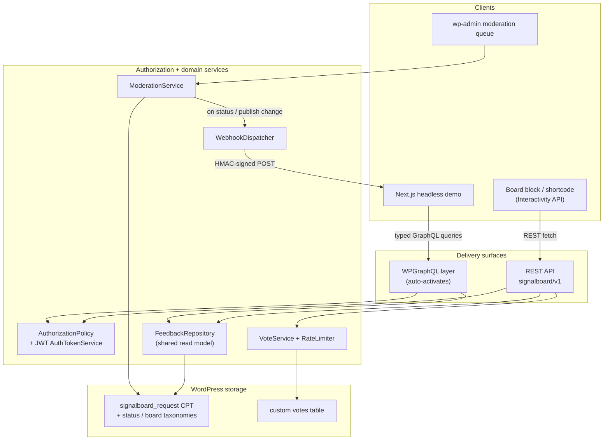

# Signalboard architecture

Signalboard is a headless-ready feature-voting, feedback, and roadmap plugin for
WordPress. This document explains what it is, how the pieces fit together, and —
most importantly — **why it is built the way it is**. It is written for a hiring
engineer or a wp.org visitor evaluating the codebase, not just for a user.

## Overview

The design goal is a single source of truth behind every delivery surface. One
content model and one read model sit at the core; the **REST API**, the
**WPGraphQL** layer, the editor **block**, and the admin **moderation queue** are
all thin adapters over that core. Because they share the same services and the
same `FeedbackRequest` read model, the surfaces cannot drift out of sync — a bug
fixed in the domain is fixed everywhere at once.

The plugin is dependency-light: the REST backbone has **zero third-party runtime
dependencies**, and the GraphQL layer activates only when WPGraphQL is present.
A headless frontend (a **Next.js** reference demo) consumes the GraphQL layer
with typed queries and is kept fresh by **HMAC-signed webhooks** that trigger
on-demand revalidation.

### The layers

| Layer | Responsibility | Key modules |
| --- | --- | --- |
| Delivery | Translate HTTP/GraphQL requests into service calls | `Rest\RequestsController`, `Rest\AuthController`, `GraphQL\RequestsGraphQL`, `GraphQL\AuthGraphQL`, `Block\BoardRenderer` |
| Authorization | One rule per action, shared by every surface | `Auth\AuthorizationPolicy`, `Auth\AuthTokenService`, `Auth\TokenAuthenticator` |
| Domain / services | Business logic and state transitions | `Domain\FeedbackRepository`, `Domain\FeedbackRequest`, `Voting\VoteService`, `Voting\RateLimiter`, `Moderation\ModerationService`, `Webhook\WebhookDispatcher` |
| Storage | WordPress-native persistence | `signalboard_request` CPT, status/board taxonomies, a custom votes table |

## Data-flow diagram

The loop that makes it "headless-ready": a moderator approves or re-statuses a
request in wp-admin → `ModerationService` updates the CPT → `WebhookDispatcher`
signs and POSTs the change → the Next.js app verifies the signature and
revalidates the affected pages, so the live site updates without waiting for the
ISR interval.

## Engineering decisions and rationale — why it is built this way

**One read model behind every surface.** `FeedbackRequest` is an immutable DTO
and `FeedbackRepository` is the only thing that reads it. REST, GraphQL, and the
block all consume the same shape, so representations cannot diverge and there is
one place to test the query logic.

**Authorization is a seam, not scattered checks.** `AuthorizationPolicy` answers
three questions — `can_upvote` (open), `can_submit` (any logged-in user), and
`can_moderate` (a capability). Both the REST permission callbacks and the GraphQL
mutations delegate to it, so the two APIs enforce identical rules from a single
definition.

**Self-contained JWT, but honest about its limits.** The register/login/refresh
flow lets a headless app authenticate with no companion plugin. Tokens are
HS256-signed with a per-site secret, and decoding always pins the algorithm to
avoid the JWT algorithm-confusion class of bugs. `determine_current_user` is
filtered *late* and never overrides an already-authenticated request, so core
Application Passwords and cookie auth keep working. The README documents when a
purpose-built auth plugin is the better choice.

**GraphQL is additive and optional.** Everything registered for WPGraphQL runs on
the `graphql_register_types` action, which fires only when WPGraphQL is active.
The plugin is fully functional over REST alone — the GraphQL layer is a bonus,
never a dependency.

**Deep modules for state changes.** `VoteService`, `ModerationService`, and
`WebhookDispatcher` each own one kind of change and return uniform results
(`true` / `WP_Error`). Presentation layers (the list table, the block) stay thin
and delegate, which keeps the capability and nonce rules in exactly one place.

**Webhooks sign the raw body.** `WebhookDispatcher` computes an HMAC-SHA256 over
the exact JSON body and sends it in a header the receiver recomputes. Delivery is
gated on configuration, so nothing leaves the site unless it is explicitly
enabled. The signature contract is pinned by both the plugin's isolation tests
and the reference Next.js route in `examples/nextjs/`, so the two halves can't
drift.

**Tested behavior, not implementation.** The suite is written against the public
seams (repository, policy, services, controllers) with WordPress's integration
test framework, so refactors are safe as long as behavior holds.

## The headless demo

A **Next.js** 15 (App Router) reference frontend — tracked separately — consumes
the WPGraphQL endpoint with GraphQL Codegen for typed queries, renders the board
and a status-grouped roadmap, and receives the revalidation webhook. The
signature-verifying revalidation route ships in this repo under
`examples/nextjs/` so the contract is documented even ahead of the deployed demo.

## Portfolio follow-ups (manual, outside the tracker)

These are deliberately not automated; they are the human-authored artifacts that
wrap the codebase for a portfolio audience:

- [ ] **Demo video / GIF** — a 60–90s screen capture of the full loop: submit a
  request → upvote it → approve and re-status it in the moderation queue → watch
  the headless page revalidate live. Link it from the README once recorded.
- [ ] **Case study** — a written case study / blog post on the design decisions
  above (the shared read model, the authorization seam, the signed webhook loop)
  and the trade-offs behind them.
